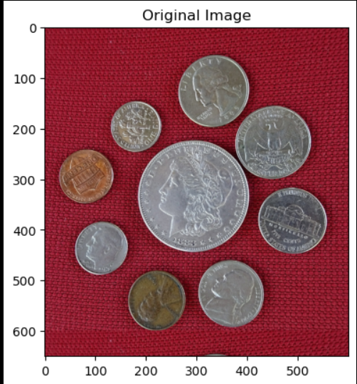

# Coin Detection using OpenCV

This project demonstrates a simple **coin detection system** using image processing techniques in **Python** with **OpenCV**. The main goal is to identify and count coins in an input image using methods like grayscale conversion, blurring, edge detection, and circle detection.

---

## 📌 Features

* Reads coin images and preprocesses them
* Applies Gaussian blur to reduce noise
* Uses Canny Edge Detection
* Detects circular shapes using the Hough Circle Transform
* Draws boundaries around detected coins
* Counts the number of coins in the image

---

## 🛠 Technologies Used

* **Python**
* **OpenCV**
* **NumPy**
* **Jupyter Notebook**

---

## 📂 Project Structure

```
Coin-Detection.ipynb   # Main Jupyter Notebook containing the code
images/                # (Optional) Folder to store coin images
README.md              # Documentation file
```

---

## ▶️ How to Run

1. Install the required libraries:

   ```bash
   pip install opencv-python numpy
   ```

2. Open the notebook:

   ```bash
   jupyter notebook Coin-Detection.ipynb
   ```

3. Run all cells to perform detection on the sample image.

---

## Output




---

## ✨ Future Improvements

* Classify coins by size or value
* Improve accuracy under different lighting conditions
* Add image upload UI

---

